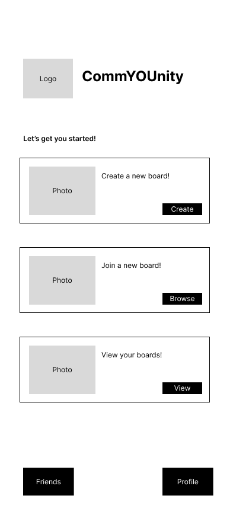
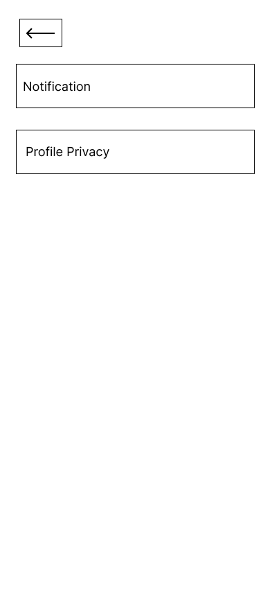
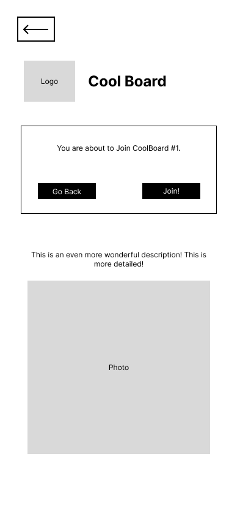

# CommYOUnity UX Design

## Prototype
Our prototype features interactive buttons and navigation through all the proposed App Map/Wireframe screens. 

If you want to view ou prototypr, click on this [link](https://drive.google.com/file/d/1l-_9agVdzB0AQ_QnYdtXnzsqeP_-oqas/view?usp=sharing).

## App Map

This app map shows the overall navigation structure of CommYOUnity, including the relationships between key features such as user profiles, boards, friends, and notifications.

---

## Wireframes

### 1. Login

Screen where users log into their accounts using username and password.

---

### 2. Sign Up

Screen for new users to create an account and join the community.

---

### 3. Home

Main feed showing boards, posts, and quick access to other community features.

---

### 4. Profile

Displays the user’s profile details, account information (hobbies, interests etc)

### 4.1 Edit Profile

Allows users to update their profile information and profile photo.

### 4.2 Settings

User settings for notifications and privacy.

### 4.2.1 Profile Privacy

Screen for adjusting privacy settings for profile visibility and who can message you.

### 4.2.2 Notification

Screen for adjusting notification settings for your profile.

### 4.3 Delete Profile

Screen for confirming deletion of the user account.

---

### 5. Create a New CommYOUnity Board

Form to create and name a new community board.

### 5.1 Send Invite

Screen for sending invitations to users for boards.

### 5.2 Invite Friends

Screen for sending friend invites.

---

### 6. View Your CommYOUnity Boards

Shows all community boards the user is part of or has created.

### 6.1 View Board

Displays posts and interactions within a selected community board.

### 6.1.1 View Members

Displays detailed info about members in a board.

### 6.1.2 Create New Post

Allows users to add a new post to a community board.

### 6.2 Edit Board

Allows admins to update board settings, description, and members.

### 6.2.1 Manage Members

Allows board admins to manage members.

---

### 7. Browse CommYOUnity Boards

Screen to browse all available commyounity boards.

### 7.1 Join

Screen to confirm joining a new board.

### 7.2 Members

List of all members in a board.

### 7.2.1 View Profile

Shows another user's profile details for viewing or interaction.

---

### 8. Friends

A simplified overview of friends for quick navigation.

### 8.1 Friend List

Shows all friends of the user and allows access to their profiles.

### 8.3 Friend Requests

Lists incoming friend requests for management.

---

## Notes
All wireframes are designed mobile-first with consistent layout, spacing, and element placement across screens.

