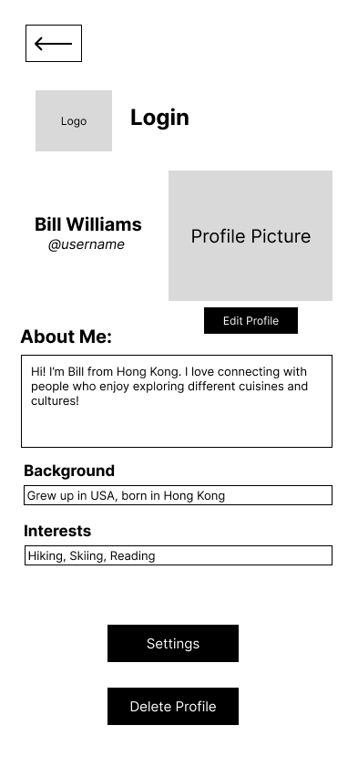

# CommYOUnity UX Design

## Prototype
Published in the later sprints!

## App Map

This app map shows the overall navigation structure of CommYOUnity, including the relationships between key features such as user profiles, boards, friends, and notifications.

---

## Wireframes

### Login

Screen where users log into their accounts using username and password.

### Sign Up

Screen for new users to create an account and join the community.

### Home

Main feed showing boards, posts, and quick access to other community features.

### Profile

Displays the user’s profile details, account information (hobbies, interests etc)

### Edit Profile

Allows users to update their profile information and profile photo.

### Profile Privacy

Screen for adjusting privacy settings for profile visibility and who can message you.

### Create New Board

Form to create and name a new community board.

### View Your CommYOUnity Boards

Shows all community boards the user is part of or has created.

### View Board

Displays posts and interactions within a selected community board.

### Create New Post

Allows users to add a new post to a community board.

### Browse CommYOUnity Boards

Screen to browse all available boards in the community.

### Friend List

Shows all friends of the user and allows access to their profiles.

### Friends

A simplified overview of friends for quick navigation.

### Friend Requests

Lists incoming friend requests for management.

### Invite Friends

Screen for sending friend invites.

### Invite Members

Allows inviting other users to join a specific board.

### Join

Screen to request joining a board.

### Manage Members

Allows board admins to manage members.

### Members

List of all members in a board with basic info.

### View Members

Displays detailed info about members in a board.

### View Profile

Shows another user's profile details for viewing or interaction.

### Send Invite

Screen for sending invitations to users for boards.

### Notification

Lists notifications shown.

### Edit Board

Allows admins to update board settings, description, and members.

### Delete Profile

Screen for confirming deletion of the user account.

### Settings

User settings for notifications and privacy.

---

## Notes
All wireframes are designed mobile-first with consistent layout, spacing, and element placement across screens.

- [Prototype instructions](instructions-0b-prototyping.md)

